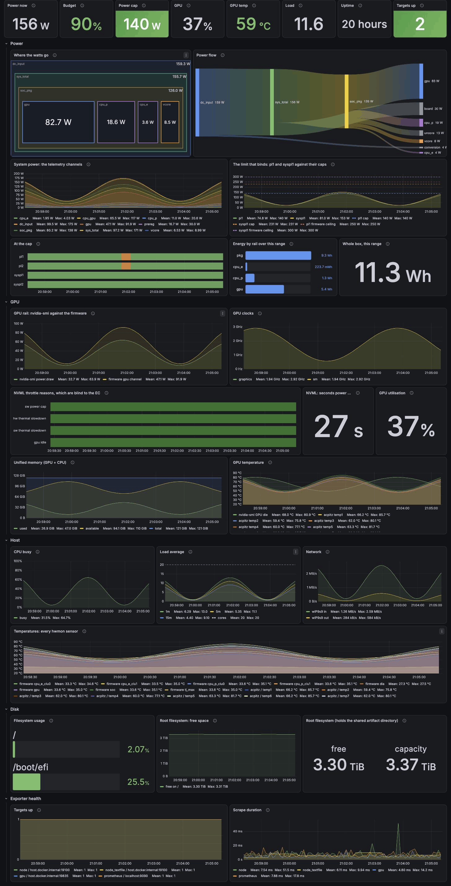

<p align="center">
  
</p>

<h1 align="center">sparkup</h1>

<p align="center">
  Your DGX Spark, as code.
</p>

---

Takes a box from a fresh DGX OS install to a working training machine: user accounts, Docker with
the NVIDIA runtime, supervised GPU and system telemetry, and Grafana on `http://spark.local` with no
login to look at it. Optionally, what a training run costs in electricity (requires a smart plug).

## What it looks like

One dashboard, provisioned from a file in this repo: GPU load, temperature, power and clocks;
CPU, unified memory and disk; and a row saying whether the exporters themselves are still alive.

<p align="center">
  
</p>

## Quick start

```bash
make deps      # once
make check     # see what would change
make apply     # converge
```

Then `make apply` again. It must report `changed=0`.

Setup, configuration and operations live in **[INSTALL_CLAUDE.md](INSTALL_CLAUDE.md)**.

## Layout

```
site.yml              the playbook
inventory/hosts.yml   which box
group_vars/all.yml    defaults for any Spark
host_vars/spark.yml   your box (untracked)
roles/                base, docker, gpu, users, spbm, exporters, shelly, monitoring, thermal, firmware, kernel
tests/                everything that runs without a Spark
```

Each role has its own README.

No Spark? `make offline` runs lint, every dashboard query against a real Prometheus, and two
roles converged twice in containers.

## License

MIT
